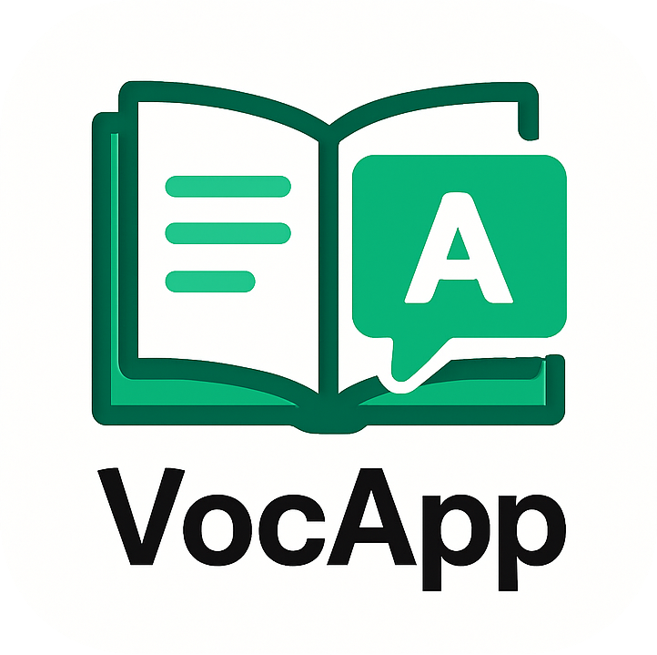

<p align="center">
  
</p>
<p align="center">
  <strong>A simple web application for building and learning vocabulary decks.</strong> 
  Designed to help prepare for language exams like Cambridge English and DELF/DALF.
</p>
<p align="center">
  <a href="https://github.com/Pianonic/VocApp"></a>
  <a href="https://github.com/Pianonic/VocApp?tab=readme-ov-file#-installation-docker-recommended"></a>
  <a href="https://github.com/Pianonic/VocApp/blob/main/devenv.md"></a>
</p>

---

## 🚀 Features
- 🗂️ **Deck Management:** Create, view, and delete vocabulary decks.
- 🏷️ **Deck Details:** Assign names, descriptions, target exams (Cambridge, DELF, etc.), and levels (A1-C2).
- ✍️ **Word Management:** Add terms, definitions, example sentences, and translations to your decks.
- 🧠 **Learning Mode:** Study decks using a simple flashcard interface (term shown first, then reveal details). Words are randomized per session.
- ✨ **Clean Interface:** Uses Bootstrap components and Tailwind utility classes for styling.
- 🐳 **Easy Deployment:** Containerized using Docker and Docker Compose for quick setup.
- 💾 **Simple Storage:** Uses SQLite for straightforward data persistence within the container (or a volume).

<!-- ## 📸 Screenshots
<p align="center">
  <strong>Deck List View:</strong><br>
  
</p>
<p align="center">
  <strong>Deck Detail & Add Word View:</strong><br>
  
</p>
<p align="center">
  <strong>Learning Mode:</strong><br>
  
</p> -->

## 📦 Installation (Docker - Recommended)

### Prerequisites:
- [Docker](https://docs.docker.com/get-docker/)
- [Docker Compose](https://docs.docker.com/compose/install/) (often included with Docker Desktop)

### Steps:
1. **Clone the repository:**
   ```bash
   git clone https://github.com/Pianonic/VocApp.git
   cd VocApp
   ```

2. **Configure Secret Key:**
   Open the `docker-compose.yml` file and **change the default `SECRET_KEY`** under the `environment` section to a strong, random string. This is crucial for security.
   ```yaml
   # docker-compose.yml
   services:
     voc-app:
       environment:
         # CHANGE THIS LINE:
         - SECRET_KEY=change_this_to_a_very_strong_random_secret_key_3498tgu934gh
   ```

3. **Build and Run:**
   From the project's root directory (where `compose.yml` is), run:
   ```bash
   docker compose up --build -d
   ```

4. **Access VocApp:**
   Open your web browser and navigate to `http://localhost:3918`.

---

## 🛠️ Usage
1. Access the running application in your browser.
2. Click "Create New Deck" to start a new vocabulary list. Fill in the details.
3. Click "View Deck" on the homepage to see a specific deck.
4. Use the "Add New Word/Phrase" form within a deck's page to add vocabulary items.
5. Click the "Learn Deck" button (appears if the deck has words) to start a flashcard session.
6. In learning mode, view the term, click "Show Answer" to reveal details, and "Next Word" to continue.

---

## 📜 License
This project is licensed under the MIT License.  
See the [LICENSE](LICENSE) file for more details.

---
<p align="center">Made with ❤️ by <a href="https://github.com/Pianonic">Pianonic</a></p>
